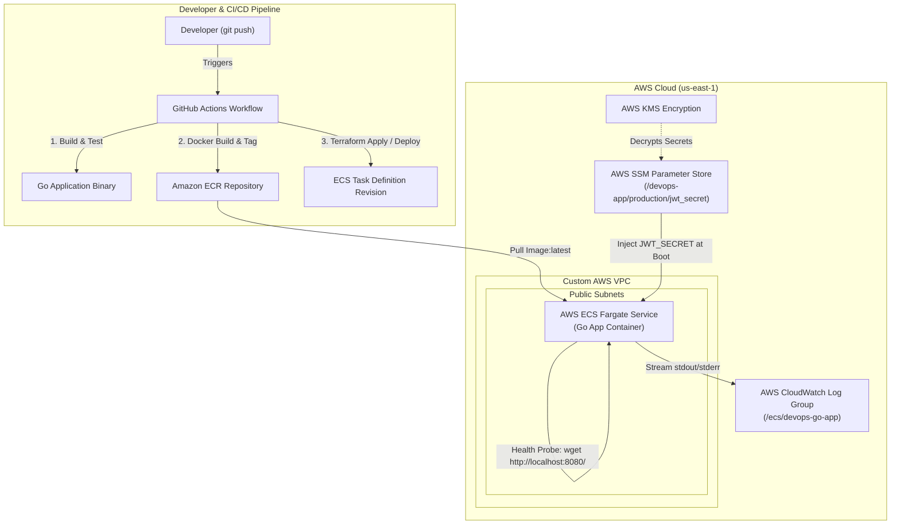

# Production-Grade AWS ECS DevSecOps Pipeline


A fully automated, production-ready Cloud Delivery & DevSecOps pipeline on **AWS ECS Fargate**, provisioned using **Terraform** and deployed via **GitHub Actions**.

---

## 🏗️ Architecture Diagram



---

## 🛡️ Key Security & Architecture Features

* **Zero-Trust Secret Management:** Credentials stored in **AWS SSM Parameter Store** (KMS encrypted) and dynamically injected into container RAM at boot time. Zero hardcoded keys in code or image layers.
* **Tamper-Proof Observability:** Container logs stream directly to **AWS CloudWatch** (`awslogs` driver), isolating operational audit logs from host file systems.
* **Automated Self-Healing & Zero Downtime:** Integrated native container health checks (`wget` HTTP probes) ensure failed container builds trigger automated deployment rollbacks without affecting live traffic.
* **Serverless Execution:** Deployed on **AWS ECS Fargate** with custom VPC networking and IAM least-privilege execution roles.
* **Automated CI/CD:** GitHub Actions pipeline triggers automated compilation, containerization, ECR pushing, and rolling ECS deployments on every push to `main`.

---

## 📂 Repository Structure

```text
├── .github/
│   └── workflows/
│       └── deploy.yml          # Automated CI/CD deployment pipeline
├── terraform/
│   ├── main.tf                 # ECS Fargate, SSM, CloudWatch, & IAM resources
│   ├── variables.tf            # Configurable environment input variables
│   └── outputs.tf              # Terraform deployment outputs
├── main.go                     # Go web server source code
├── Dockerfile                  # Multi-stage Docker build file
└── README.md                   # System architecture documentation
```
